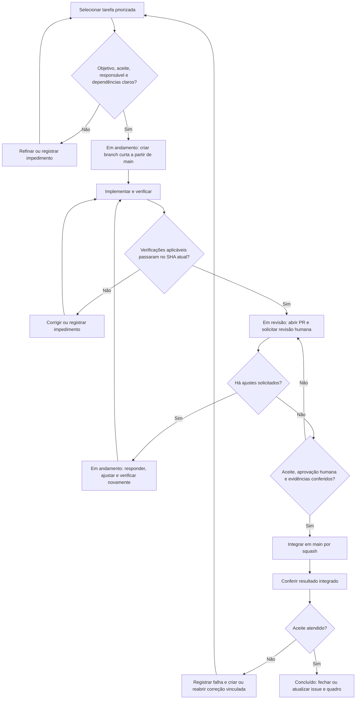

# Workflow de desenvolvimento

> Proposta para discutir com o grupo no TCC2. As regras abaixo ainda precisam ser aprovadas pela equipe. A proteção da main e os checks obrigatórios precisam ser configurados e conferidos no GitHub.

Usamos o **GitHub Flow** como base: cada alteração fica em uma branch curta e entra na `main` por um Pull Request (PR). A issue descreve a tarefa, e o quadro mostra em que etapa ela está.

## Fluxo da tarefa

Para apresentar o fluxo, há uma versão resumida em [PNG](diagrams/workflow-tcc2.png) e [SVG](diagrams/workflow-tcc2.svg), com [arquivo editável no draw.io](diagrams/workflow-tcc2.drawio). O Mermaid acima mostra as decisões e os retornos com mais detalhe.

## 1. Escolher e preparar a tarefa

Antes de começar outra tarefa, veja se há algum PR que você pode ajudar a revisar.

Escolha uma issue priorizada e combine quem vai fazer o trabalho. Ela precisa explicar o objetivo, o que deve funcionar para considerá-la pronta e se depende de outra tarefa. Isso é o que chamamos de critérios de aceite.

A proposta é usar issues como padrão. Um ajuste pequeno pode ficar só no PR, desde que a descrição explique o motivo. Se faltar alguma informação ou houver um bloqueio, registre isso na issue e combine o próximo passo.

| Estado | Quando usar |
|---|---|
| Pendente | A tarefa está cadastrada, mas o trabalho ainda não começou. |
| Em andamento | Alguém está trabalhando nela ou fazendo ajustes pedidos na revisão. |
| Em revisão | O PR está pronto para outra pessoa revisar. |
| Concluído | O resultado foi conferido e atende ao que foi combinado. |

## 2. Desenvolver e verificar

Preserve suas mudanças locais antes de atualizar a main. Crie a branch a partir da versão atualizada.

O padrão de nome é `tipo/N-descricao-curta`, quando houver issue, ou `tipo/descricao-curta` para um ajuste sem issue. Exemplo: `docs/96-workflow-tcc2`.

Faça commits pequenos no formato `tipo(escopo): descrição`, em português, minúsculas e sem ponto final. Exemplo: `docs(gcs): atualiza workflow`. Os tipos mais usados são `feat`, `fix`, `docs`, `test`, `refactor`, `chore` e `ci`.

Antes de pedir revisão:

- confira o próprio diff;
- execute os testes, build e outras verificações que fizerem sentido para a mudança;
- anote os comandos, os resultados e o que não foi testado;
- confira os checks do commit atual. O SHA é o identificador desse commit.

Um teste que passou em outra branch ou antes dos últimos ajustes não confirma que a versão atual funciona. Se um check falhar, investigue. Quando a causa for anterior à mudança ou depender de outra pessoa, registre o problema e o link da execução no PR.

## 3. Abrir o PR e pedir revisão

Abra o PR para main, preencha o template e peça revisão de outro integrante. Se o trabalho ainda estiver incompleto, use um Draft PR para o grupo acompanhar.

Para relacionar a tarefa, use `Refs #N`. A proposta inicial é fechar a issue depois de conferir o resultado na main. Use `Closes #N` somente quando toda a tarefa estiver concluída no merge e o grupo tiver combinado o fechamento automático.

Quando pedir a revisão, mova a tarefa para **Em revisão**. O revisor confere se a alteração atende à tarefa, se os testes fazem sentido e se há problemas no código ou nos documentos.

Se forem pedidos ajustes, volte para **Em andamento**, responda aos comentários, faça as correções e repita as verificações. Depois, peça uma nova revisão. Não precisa abrir uma issue para cada comentário; abra outra tarefa quando surgir algo fora do escopo do PR.

Novos commits precisam ser conferidos mesmo que já exista uma aprovação anterior. Evite reescrever o histórico depois que a revisão começar. Se precisar fazer isso ou resolver um conflito que mude o diff, avise o revisor.

## 4. Usar IA como apoio à revisão

A proposta é testar a IA como apoio, mantendo a revisão de outro integrante. A IA pode apontar possíveis problemas, mas alguém precisa conferir cada um antes de aceitar a sugestão.

Registre o PR e o commit analisados, a ferramenta usada, o contexto fornecido e o resultado. Separe os problemas confirmados dos apontamentos incorretos ou que ainda precisam ser investigados.

Esse procedimento não depende de instalar um bot. A equipe pode começar com uma revisão manual assistida e decidir depois se vale a pena automatizar. Uma resposta da IA não conta como aprovação de um colega.

## 5. Fazer o merge e concluir

Antes do merge, confira se a tarefa atende ao combinado, se outro integrante aprovou, se os comentários foram resolvidos e se as verificações passaram no commit atual.

O método proposto é **squash and merge**, que reúne os commits do PR em um commit na main.

Depois do merge, confira o resultado na main. Só então feche ou atualize a issue e mova o cartão para **Concluído**. Deixe os links do PR e das verificações na tarefa. Se algo não funcionar como esperado, registre o problema e reabra a tarefa ou crie uma correção relacionada.

A branch pode ser removida depois da integração, desde que não tenha trabalho pendente. Para uma tarefa de configuração, como ajustar o Project, registre o que mudou, confira o resultado e peça revisão de outro integrante, mesmo que não exista PR.

## Configurações que ainda precisam ser combinadas

As regras deste documento não ativam bloqueios no GitHub. O grupo precisa definir e conferir a proteção da main: aprovação por outro integrante, tratamento de novos commits, resolução de comentários, quem pode ignorar as regras e quais checks serão obrigatórios.

Os nomes dos checks devem ser conferidos nas execuções reais. A configuração deve ser validada em um PR, sem fazer push direto na main como teste.
